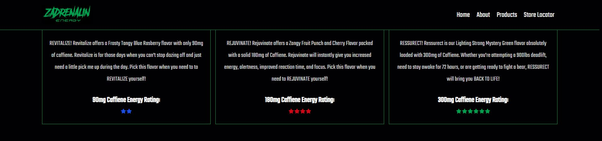

# ZADRENALIN-Energy-Drink

A website created using HTML/CSS/JS + Adobe Creative Suite to represent an imitation energy-drink product called "ZADRENALIN Energy" 

The purpose of this website is to demonstrate the ability to create and deploy a funcitoning website representing a client's product or service. Specifically, the ability to create an intriguing UI/UX design whilst paying particular attention to elements of graphic design and creative components in frontend development. 

## Screenshots

 
 
 
 
 
